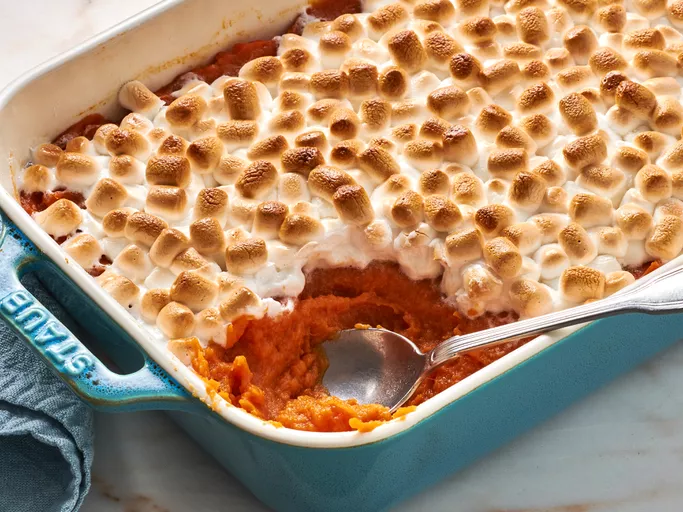

# Odin Recipes

Welcome to Odin Recipes, your go-to source for delightful and easy-to-follow recipes. Whether you're planning a festive feast or a casual get-together, we've got you covered with these mouthwatering dishes.

## Project Structure

odin-recipes/
│
├── images/
│ ├── candy-cane-dessert.webp
│ ├── sweet-potato-casserole.webp
│ └── turkey.webp
│
├── recipes/
│ ├── candy-cane.html
│ ├── potato-casserole.html
│ └── turkey.html
│
├── index.html
│
├── README.md
│
└── .gitignore

## Recipes

1. **[Simply Perfect Roast Turkey](./recipes/turkey.html)**

   - 
   - This simple roast turkey, seasoned with salt and pepper, is basted with turkey stock to enhance its flavors. It's a classic dish that will remind you of grandma's cooking.

2. **[Sweet Potato Casserole with Marshmallows](./recipes/potato-casserole.html)**

   - 
   - A gooey and delicious sweet potato casserole with marshmallows, perfect for holidays. It's a family favorite that you can bake ahead and reheat.

3. **[Layered Candy Cane Dessert](./recipes/candy-cane.html)**
   - 
   - A no-bake treat with layers of Oreo crust, candy cane, cheesecake pudding, whipped topping, and crushed candy canes. Perfect for potlucks and holiday parties.

## How to Use

1. Clone this repository to your local machine:

   ```bash
   git clone https://github.com/gabrielcg89/odin-recipes.git
   ```

2. Navigate to the project directory:

   ```bash
   cd odin-recipes
   ```

3. Explore the recipes by opening the respective HTML files in your browser.

   Feel free to explore, experiment, and make these recipes your own. Happy cooking!

## Contributing

If you'd like to contribute to Odin Recipes, please follow our [contribution guidelines](CONTRIBUTING.md).

## License

This project is licensed under the [MIT License](LICENSE).
